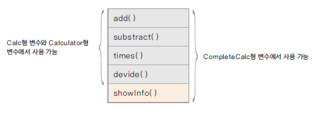

# 11. 인터페이스(interface)

## 인터페이스란?


- 모든 메서드가 추상 메서드로 선언됨 public abstract

- 모든 변수는 상수로 선언됨 public static final

```
interface 인터페이스 이름{

    public static final float pi = 3.14F;
    public void makeSomething();
}
```

- 자바 8 부터 디폴트 메서드(default method)와 정적 메서드(static method) 기능의 제공으로 일부 구현 코드가 있음

## 인터페이스 정의와 구현


Calc.java
```
public interface Calc {

	double PI = 3.14;
	int ERROR = -99999999;
	
	int add(int num1, int num2);
	int substract(int num1, int num2);
	int times(int num1, int num2);
	int divide(int num1, int num2);
	
}
```

Calculator.java
```
public abstract class Calculator implements Calc{

	@Override
	public int add(int num1, int num2) {
		return num1 + num2;
	}

	@Override
	public int substract(int num1, int num2) {
		return num1 - num2;
	}
}
```

CompleteCalc.java
```
public class CompleteCalc extends Calculator{
	
	@Override
	public int times(int num1, int num2) {
		return num1 * num2;
	}

	@Override
	public int divide(int num1, int num2) {
		if( num2 == 0 )
			return ERROR;
		else 
			return num1 / num2;
	}
	
	public void showInfo() {
		System.out.println("모두 구현하였습니다.");
	}
}
```

CalculatorTest.java
```
public class CalculatorTest {

	public static void main(String[] args) {
		Calc calc = new CompleteCalc();
		int num1 = 10;
		int num2 = 2;
		
		System.out.println(num1 + "+" + num2 + "=" + calc.add(num1, num2));
		System.out.println(num1 + "-" + num2 + "=" +calc.substract(num1, num2));
		System.out.println(num1 + "*" + num2 + "=" +calc.times(num1, num2));
		System.out.println(num1 + "/" + num2 + "=" +calc.divide(num1, num2));
	}
}
```


## 인터페이스 구현과 형 변환

- 인터페이스를 구현한 클래스는 인터페이스 형으로 선언한 변수로 형 변환 할 수 있음

Calc calc = new CompleteCalc();

- 상속에서의 형 변환과 동일한 의미

- 클래스 상속과 달리 구현 코드가 없으므로 여러 인터페이스를 구현할 수 있음 ( cf. extends)

- 형 변환되는 경우 인터페이스에 선언된 메서드만을 사용가능함 

